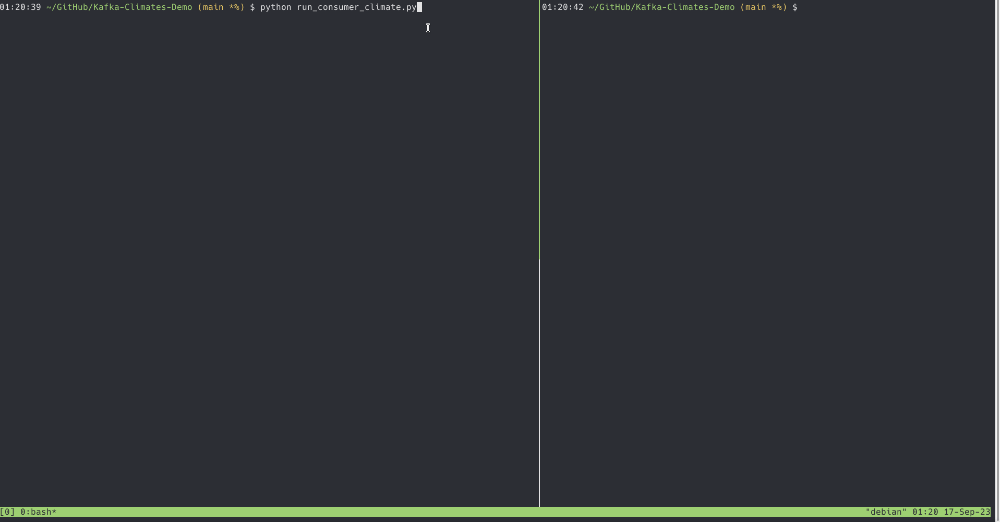
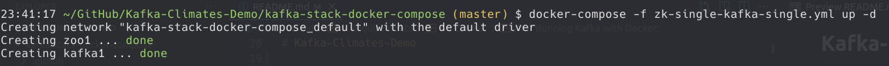
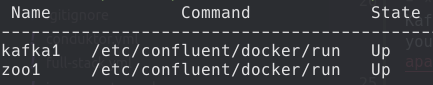
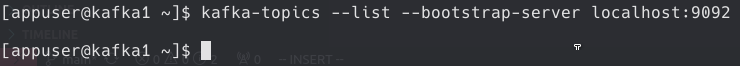
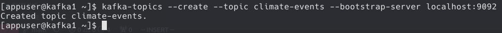
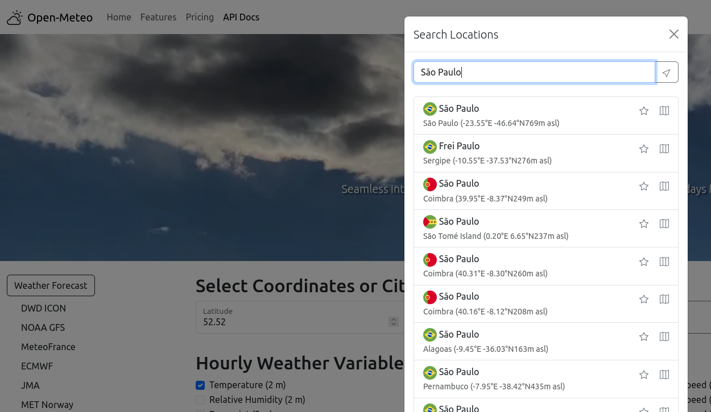

# Kafka-Climates-Demo

A simple application to obtain the max temperature of the day and notify if the temperature is high. Producer to send the data from the API to a broker and obtain the data for analysis using a Consumer (Kafka).



# Requirements

## Docker

- **Note 1:** I'm using [Docker](https://www.docker.com/) to create a Kafka Server (Kafka Broker), if you want to use without containerization you can follow this tutorial to set up the Kafka Server: [https://kafka.apache.org/quickstart](https://kafka.apache.org/quickstart).

- **Note 2:** To install Docker and Docker Compose, use the official documentation: [https://docs.docker.com/engine/install/](https://docs.docker.com/engine/install/). I'm using Debian Bookworm in this application.

### Running Kafka with Docker:

- I'll use the docker compose file of the [Conduktor.io](https://www.conduktor.io/) that has several configurations, for this code we need the simplest configuration (single Zookeper and a single broker).
- Clone the repository with the following command: 

```console
$ git clone https://github.com/conduktor/kafka-stack-docker-compose.git
```

- Now, create a Kafka cluster with one Zookeeper and one Kafka broker

```console
$ cd kafka-stack-docker-compose  # change to directory of docker compose
$ docker-compose -f zk-single-kafka-single.yml up -d
```



- Check if both the services are running in the background (-d flag above)

```
$ docker-compose -f zk-single-kafka-single.yml ps
```



- One way to interact with the server is by starting an interactive session on the Docker (kafka1 because it's the username configured):

```console
docker exec -it kafka1 /bin/bash
```

- Run the command to show a list of topics (if this is the first will be empty):

```console
$ kafka-topics --list --bootstrap-server localhost:9092
```



- Create a new topic using the command line called: “climate-events" with the following command:

```console
kafka-topics --create --topic climate-events --bootstrap-server localhost:9092
```



## Python

- Create an environment using [virtualenv](https://virtualenv.pypa.io/en/latest/) and activate installing the two libraries required:

```console
$ python -m venv .venv
$ source activate .venv/bin/activate # unix
$ pip install requests kafka-python
```

# Overview of the API

- The API is provided by [Open-Meteo](https://open-meteo.com/) which is possible to obtain values of weather for different localities, see the documentation of the API: [https://open-meteo.com/en/docs/climate-api](https://open-meteo.com/en/docs/climate-api).

- The idea of the script [run_climate_api.py](./run_climate_api.py) is to obtain the value of the **max temperature** of the day from the start of the month until the date today. This will write on the broker on the topic "climate-events” created before.
  
- We can see the events using a Consumer [run_consumer_climate.py](./run_consumer_climate.py) and check if the temperature is higher than a threshold will notify (a simple print in our program) that day the temperature is high.

# Running

- First, you can change the localization, modifying the `latitude` and `longitude` on the script [run_climate_api.py](./run_climate_api.py) (change the query). You can use the own site to obtain the values: [https://open-meteo.com/en/docs](https://open-meteo.com/en/docs)



- Second, open a new terminal to run the consumer [run_consumer_climate.py](./run_consumer_climate.py) and execute the following command:

```console
$ python run_consumer_climate.py
```

- Finally, open a second terminal and run the script to obtain the data from the API [run_climate_api.py](./run_climate_api.py) and when the value is higher than the threshold will on the terminal that is executing the consumer.

# Stopping

- For stop the python scripts, just close both terminals.

- Stopping the docker composer (inside the directory with the script):

```console
$ docker-compose -f zk-single-kafka-single.yml stop
```

- Stopping and deleting all the resources change `stop` to `down`

```console
$ docker-compose -f zk-single-kafka-single.yml down
```